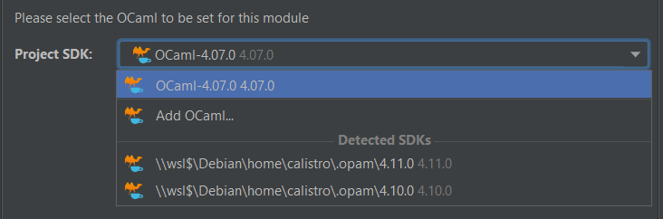

# OCaml plugin IntelliJ

This plugin is based on [ReasonML](https://github.com/giraud/reasonml-idea-plugin), but **I'm tuning it for my personal use**. **I'm not planning to maintain this repository**, so you should work on the original plugin.

> **Created on**: Windows 10/11 for IntelliJ 
> **Goal**: easy to install, complete, compatible in minor IDE, OCaml only. Use WSL+opam on Windows.

## My features

I'm starting the plugin "from scratch". The features here, are the ONLY features available.

* **create a project**: 

> It will set up a library for OCaml in External libraries. You will be able to change the version of OCaml in the Settings. You may only pick an OCaml version installed using opam.
> 
> **Note**: multiples modules aren't supported (problem with the settings: switching SDK, etc.). Allow the user to install new versions/packages.