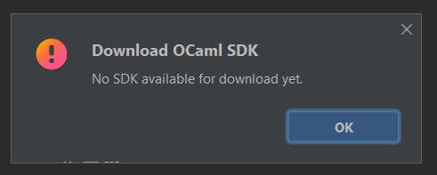

# OCaml plugin IntelliJ

This plugin is based on [ReasonML](https://github.com/giraud/reasonml-idea-plugin), but I'm tuning it for my personal use. I'm not planning to maintain this repository, so you would either have to submit Pull Requests to the original plugin, fork this one, or ask me to become the maintainer.

## Setup

As I'm not planning to release it on the Marketplace, the only way to install this plugin is to

* Download the zip
* Go to your plugins folder
* Extract the zip
* Restart your IDE
* Done

## My features

* **create a project** (seems OK)

* **Switch JDK** (on it, can switch after setting once)

* **Download SDK** (not yet)

This is not available yet, but we will be able to download an SDK given a version using my portable opam.

